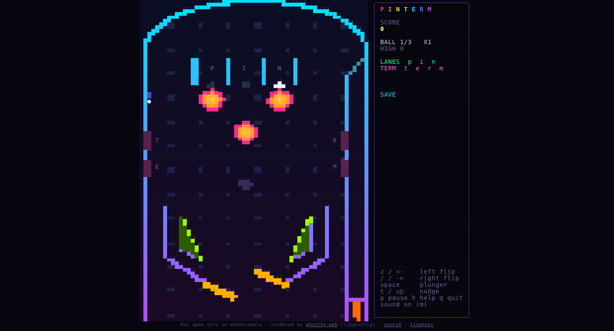

# pinterm

[](https://thelio-nixos.tail66c90.ts.net/mechatron-prime/)

A top-down pinball game that plays in your terminal, and in a web browser. The table is neon, the
ball stays easy to see, and the sound effects are synthesized live. The game
logic (physics, scoring, rendering decisions and audio synthesis) is written in
[Roc](https://www.roc-lang.org/); a small C program handles the terminal, the
clock and the speaker.



*The browser build, captured by the test driver in headless Chromium. The
terminal build draws the same frames, byte for byte.*

## Play

With [Nix](https://nixos.org/) (flakes enabled):

```sh
./build          # optimized build; publishes bin/linux/<arch>/pinterm
./bin/pinterm    # play (builds first if needed)
```

or `nix run github:pmarreck/pinterm`.

### In a browser

Play it at **<https://pmarreck.github.io/pinterm/>**.

`nix build .#web` (or `./build-web`) produces a static site in `result/`
(or `out/web/`). Serve it with any static file server and open
`index.html`. Use `?seed=N` for a repeatable game, `?table=N` to open on a
given table (0 to 3) and `?demo` for a self-playing attract mode.

On phones and tablets, touch and hold the lower-left or lower-right corner
for the flippers, and swipe down anywhere else to pull the plunger; a longer
swipe (about a third of the screen) launches harder. Between games, swipe left
or right to change tables. A firm bump of the device nudges the table; iOS
asks for motion permission after the first touch. In portrait the table
fills the screen with a compact score bar on top.

### Controls

| Key | Action |
|---|---|
| `z` or Left arrow | left flipper |
| `/` or Right arrow | right flipper |
| Space or Down arrow | plunger: hold to pull, release to launch (a single tap launches at full power) |
| `t` or Up arrow | nudge the table (nudge too often and the table tilts) |
| `[` / `]`, or PageUp / PageDown | previous / next table (between games) |
| `p` | pause |
| `m` | mute or unmute |
| `h` or `?` | help |
| `n` | new game |
| `q`, Esc or Ctrl-C | quit |
| Ctrl-Z | suspend (resume with `fg`) |

### Tables

Four tables share the cabinet, plunger lane and lower playfield (flippers,
slingshots, inlanes), so the flippers feel the same everywhere. Each table has
its own upper playfield, rules, gravity, colors and high score. Change tables
between games; the old table slides off and the new one slides in.

| Table | Features |
|---|---|
| Classic | P-I-N lanes, three pop bumpers, T-E-R-M stand-up targets, center saucer |
| Orbital | W-A-R-P lanes, a diamond of four bumpers, an I-G-N-I-T-E drop-target bank, a launch ramp up the left side and a black-hole saucer |
| Iron Horse | W-E-S-T lanes, C-O-A-L targets and two crossing ramps; each ramp adds a car to the train, and four cars light the saucer |
| Graveyard | steeper (stronger gravity), B-O-O lanes, an R-I-P drop bank, two jackpot ramps and an upper right flipper |

The alternates are original layouts in the style of classic digital tables:
Orbital after *Ignition* from Pinball Dreams (1992) and *Space Cadet* from
3D Pinball for Windows, Iron Horse after the Old West train table *Steel
Wheel*, and Graveyard after *Nightmare*, both also from Pinball Dreams. The
sources found did not document those playfields exactly, so these borrow
themes and features rather than geometry. Press `h` in game for the current
table's rules.

### Rules

You have three balls. Pop bumpers score 100 and slingshots 10, times the
bonus multiplier. Rolling through all of a table's top lanes raises the
multiplier, up to x5. The flippers rotate which lanes are lit. Completing the
table's target bank (stand-up or drop targets), or on Iron Horse riding four
ramps, lights the center saucer, and putting a ball into the lit saucer starts
two-ball multiball. A ramp scores 1,000 times the ramp combo (ramps within
4 seconds of each other count up) and raises the jackpot; during multiball a
ramp also scores a super jackpot of half the jackpot. During multiball, each
saucer shot scores a growing jackpot. Scoring several hits within about
1.5 seconds builds a combo. A blinking top lane at launch is a skill shot.
Each ball gets one ball save shortly after launch. End-of-ball bonus counts
your hits, unless you tilted.

### Options

```text
--ascii, --simple   plain ASCII glyphs and no color
--no-color          monochrome
--colors MODE       truecolor | 256 | 16 | mono (default: detected from TERM/COLORTERM)
--mute / --sound    sound off / force sound on (sound is off by default over SSH)
--seed N            deterministic randomness
--fps N             frame rate, 20-120 (default 60)
--about, --help
```

`PINTERM_MUTE=1` also disables sound. Run `pinterm --help` for the headless
replay options used by the tests.

## Terminal and audio compatibility

- **Keyboard.** Most terminals report key presses but not key releases. In
  that case a flipper stays up for about 0.4 seconds per press, and holding
  the key extends that through autorepeat. Terminals that support the
  [kitty keyboard protocol](https://sw.kovidgoyal.net/kitty/keyboard-protocol/)
  (kitty, foot, WezTerm, Ghostty and others) report releases, and pinterm then
  follows your fingers exactly.
- **Display.** The table scales to fit the terminal; 80x24 works and larger
  is nicer. Below 36x14 the game asks you to enlarge the window. Color
  falls back from 24-bit to 256 colors, 16 colors, monochrome blocks, or plain
  ASCII. Only changed cells are redrawn, so the game also plays well over SSH.
- **Sound.** Audio is mono 16-bit PCM at 22050 Hz, synthesized in Roc and
  streamed to the first player found: `pw-play` (PipeWire), `paplay`
  (PulseAudio) or `aplay` (ALSA). With none of these, the game is silent.
  pinterm never changes system audio settings.
- **Cleanup.** The terminal is restored after a normal quit, Ctrl-C, SIGTERM,
  a crash signal, or suspend.

## Platform support

| Target | Status |
|---|---|
| Web browser (WebAssembly) | built and tested in headless Chromium; identical frames to the terminal build |
| Linux x86_64 | built and tested (static musl binary) |
| Linux aarch64 | build script supports it; not yet verified |
| macOS aarch64 | not yet supported: the pinned Roc compiler's Nix package is marked broken on Darwin |
| Windows x86_64 / aarch64 | not yet supported: the terminal host is POSIX-only |

## How it works

```text
host/pinterm.c        terminal raw mode, frame clock, input bytes, audio player pipe
   │  ▲  (tick packet: clock, size, flags, raw input bytes)
   ▼  │  (frame bytes, PCM samples, event log lines)
platform/             Roc platform: hosted functions and allocator shim
src/Loop.roc          one pure step per frame: decode -> Game.step -> render -> mix
src/Game.roc          state machine, physics and scoring (fixed 1/480 s substeps)
src/Physics.roc       circle-vs-capsule contact, moving-flipper impulses
src/Table.roc         table geometry shared by physics and rendering
src/Input.roc         byte/escape-sequence/kitty-protocol decoder
src/Render.roc        half-block rasterizer, panel, color fallbacks, diff encoder
src/Audio.roc         chiptune voices and mixer
web/platform/         browser platform: wasm32 host, boxed state, output buffers
web/site/             page shell: ghostty-web terminal, keys, Web Audio
```

Everything above the C host is a pure function. Each frame, `Loop.frame`
takes the previous state and the host's tick packet and returns the next
state, the bytes to draw, the audio samples and log lines. Because of that,
nearly everything is tested without a terminal.

The Roc compiler is pinned to upstream revision `1a4df199` through
`flake.nix`, with a small patch: readonly data that holds pointers is
emitted as an ELF RELRO section, which the native linker requires.

## The browser build

The browser version is the same game, not a port. The Roc core is compiled
a second time, for `wasm32`, against a small web platform (`web/platform/`):
a freestanding C host with a free-list allocator and buffers that JavaScript
reads and writes. JavaScript keeps the game state between animation frames
and calls the same `Loop.frame` the terminal build uses.
[ghostty-web](https://github.com/coder/ghostty-web), Ghostty's terminal
emulator compiled to WebAssembly, displays the ANSI output. The core's PCM
plays through Web Audio. Browsers report real key releases, so the page
sends the same kitty-protocol release sequences a capable terminal would,
and the flippers follow your fingers exactly.

The site is published to GitHub Pages from the `gh-pages` branch by
`./deploy-web`. It builds `.#web` with Nix from a clean checkout whose
`HEAD` is already on `origin/yolo`, records that source commit in the
deploy commit, and does nothing if the site is unchanged.

The test suite replays the same seeded input through the native terminal
host and through the WebAssembly module under Node.js, and requires
identical event logs and identical frame bytes. It also loads the built page
in headless Chromium and plays it with real keyboard events.

## Tests

```sh
./test             # everything; rebuilds only if a linked input changed
./test --rebuild   # force the optimized build
```

`./test` runs:

- the Roc expectations (physics, game flow, input decoding, rendering, audio
  synthesis and the per-frame loop);
- CLI checks;
- headless scripted replays that play to game over and must reproduce the
  same event log from the same seed;
- PCM capture checks;
- real pseudo-terminal sessions confirming that terminal state is restored
  after quit, signals and suspend/resume;
- the browser build: a native-versus-WebAssembly differential replay and a
  headless Chromium session driven by real keyboard events.

Continuous integration runs on Mechatron Prime CI, a self-hosted Nix build
service that builds `packages.x86_64-linux.default`,
`packages.x86_64-linux.web` and `checks.x86_64-linux.test` for every push.

The tests check that the game works. Whether it is fun to play and the sound
is pleasant still takes a human player.

## License

MIT. See [LICENSE](LICENSE). The native and web packages also include the
license of Roc (UPL 1.0, for compiler builtins linked into the game), and the
web site includes ghostty-web's MIT license.
